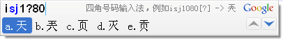

- *KusonStack一站式可编程配置技术栈(Go): https://github.com/KusionStack/kusion*
- *KCL 配置编程语言(Rust): https://github.com/KusionStack/KCLVM*
- *凹语言(凹读音“Wa”)(The Wa Programming Language): https://github.com/wa-lang/wa*

----

## 简介

Google输入法四角号码扩展 基于 Google输入法 Lua扩展API 开发, 实现了基本的四角号码输入功能.

报告: [四角号码检字法](https://github.com/chai2010/talks/blob/master/%E5%9B%9B%E8%A7%92%E5%8F%B7%E7%A0%81%E6%A3%80%E5%AD%97%E6%B3%95.pdf)

## 安装

首先下载 [im4corner.lua](https://github.com/chai2010/im4corner/blob/master/im4corner.lua) 脚本, 并复制到以下目录(不同版本系统有区别)：

	XP: C:\Documents and Settings\All Users\Application Data\Google\Google Pinyin 2\Extensions\
	XP: C:\Documents and Settings\All Users\Application Data\Google\Google Pinyin 3\Extensions\
	Vista / Windows 7: C:\ProgramData\Google\Google Pinyin 2\Extensions\
	Vista / Windows 7: C:\ProgramData\Google\Google Pinyin 3\Extensions\

然后，打开谷歌拼音输入法选项设置窗口, 在"扩展"页面中, 点击"安装扩展包"按钮, 选择保存在计算机内的 im4corner.lua (也可以从Windows资源管理器, 右键单击 im4corner.lua 文件, 选择“安装到谷歌拼音输入法”).

**由于四角号码的命令缩写"sj"已经在"base.lua"中被用作“时间”命令**. 因此使用四角号码扩展脚本时不要加载base.lua脚本, 或者把base.lua中相关代码注释掉(910行附近):

	------------
	-- ime.register_command("sj", "GetTime", "输入时间", "alpha", "输入可选时间，例如12:34")

## 使用

**基本用法**

安装后, 打开记事本程序, 切换到谷歌拼音输入法, 键入"isj"可以看到参数提示:

键入"isj1080", 谷歌拼音输入法的候选项窗口中将出现候选项: "a.天 b.兲 c.页 d.灭 e.贡".

其中, 右上角是简单的帮助信息: "四角号码输入法, 例如isj1080[?] -> 兲"中的"[?]".

**使用通配符**

如果不能确定某个角码, 可以用“?”符号代替(内部将作为0-9处理). 例如输入"isj1?80":

如果统配符在末尾, 则可以省略, 例如输入"isj108":

如果匹配的字符超过(约)128个，则多余的部分会被丢弃(Google拼音2.3.13.82版本的限制).

**显示角码和拼音**

在第五个参数输入字符“?”, 则显示和输出每个汉字的完整角码和拼音, 例如输入"isj1080?":

如果要显示拼音时, 前面不足的字符可以用"?"填充. 例如"isj108"要显示拼音可以输入"isj108??":

其中显示角码功能还可以用于学习四角号码查字法. 例如输入"isj10???"可以查看以"10"开头的汉字:

**显示帮助信息**

当参数全部是"?"字符时, 则显示四角号码的一些历史信息和查字的口诀.

## 附录

* 项目主页 : [https://github.com/chai2010/im4corner](https://github.com/chai2010/im4corner)
* 四角号码 : [http://zh.wikipedia.org/zh-cn/四角号码](http://zh.wikipedia.org/zh-cn/%E5%9B%9B%E8%A7%92%E5%8F%B7%E7%A0%81)
* 四角号码表: [http://vimim-data.googlecode.com/svn-history/r128/trunk/data/vimim.4corner.txt](http://vimim-data.googlecode.com/svn-history/r128/trunk/data/vimim.4corner.txt)
* 汉语拼音表: [http://vimim-data.googlecode.com/svn-history/r128/trunk/data/vimim.pinyin.txt](http://vimim-data.googlecode.com/svn-history/r128/trunk/data/vimim.pinyin.txt)
* 输入法扩展: [http://www.google.com/ime/pinyin/api.html](http://www.google.com/ime/pinyin/api.html)
* 调试器代码: [https://github.com/phuang/ibus-pinyin/blob/master/lua/lua-ext-console.c](https://github.com/phuang/ibus-pinyin/blob/master/lua/lua-ext-console.c)
